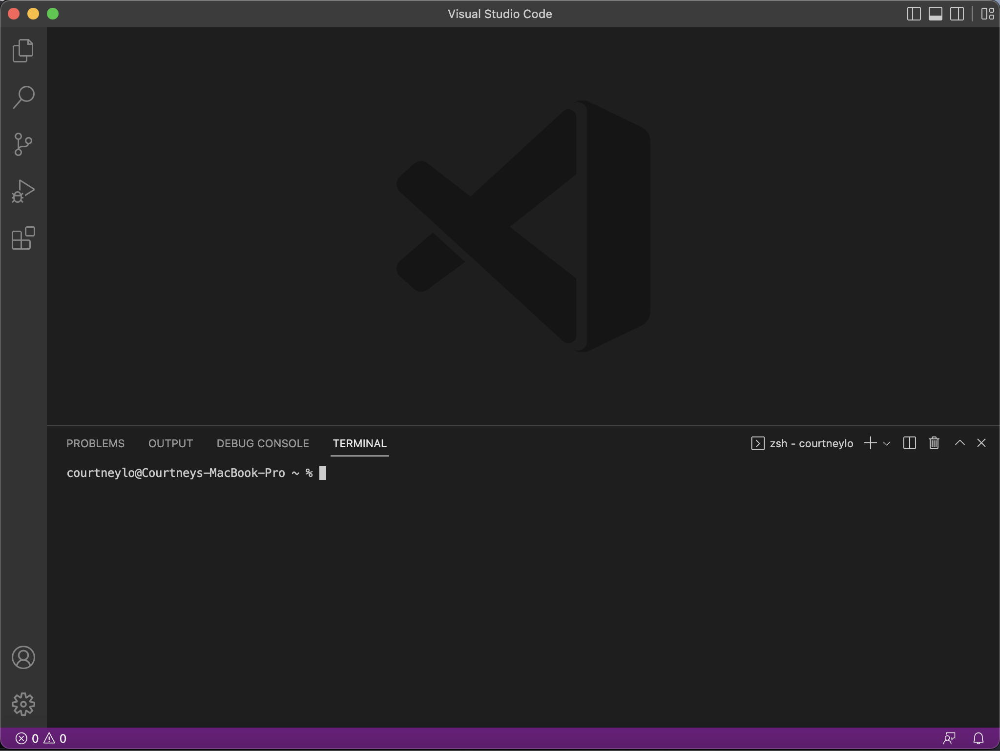

## Week 1 Lab Report - Tutorial
#### Step 1: Installing VS Studio Code

To install Visual Studio Code on your pc, follow the download and installation instructions on the [webite](https://code.visualstudio.com/)  for your respective pc type. After installing and opening the app, your screen should match the image below.

*Note: Depending on your individual pc system and settings, the colors may differ than what's shown in the image above.

#### Step 2: Remotely Connecting
#### Step 3: Trying Some Commands
